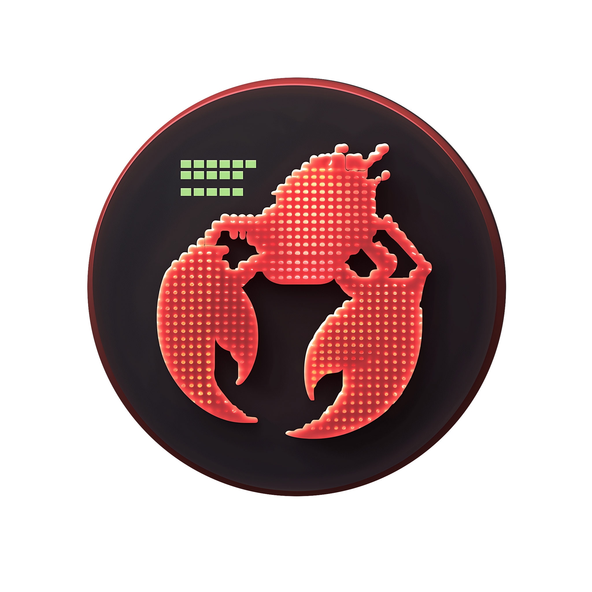

<p align="center">
  
</p>

<h1 align="center">Clawome</h1>

<p align="center">
  <strong>One API call. Any web task. Done.</strong><br/>
  Give your AI agent a natural language goal — Clawome plans, browses, and returns structured results.
</p>

<p align="center">
  <a href="#task-agent-api">Task Agent API</a> &bull;
  <a href="#quick-start">Quick Start</a> &bull;
  <a href="#dom-compression">DOM Compression</a> &bull;
  <a href="#benchmarks">Benchmarks</a> &bull;
  <a href="#roadmap">Roadmap</a>
</p>

---

## Task Agent API

One POST request. Clawome handles the rest — planning subtasks, controlling the browser, reading pages, and returning results.

```bash
curl -X POST http://localhost:5001/api/agent/start \
  -H "Content-Type: application/json" \
  -d '{"description": "Find AI-related graduate programs at NYU Tandon School of Engineering"}'
```

Poll progress:

```bash
curl http://localhost:5001/api/agent/status
```

```json
{
  "status": "completed",
  "final_result": "NYU Tandon offers these AI-related programs: ...",
  "subtasks": [
    {"step": 1, "goal": "Visit NYU Tandon website", "status": "completed"},
    {"step": 2, "goal": "Extract program list", "status": "completed"}
  ],
  "llm_usage": {"calls": 12, "input_tokens": 25000, "total_tokens": 28000}
}
```

Cancel if needed:

```bash
curl -X POST http://localhost:5001/api/agent/stop
```

| Method | Endpoint | Description |
|--------|----------|-------------|
| POST | `/api/agent/start` | Submit a task (natural language) |
| GET | `/api/agent/status` | Poll progress, subtasks, and results |
| POST | `/api/agent/stop` | Cancel running task |

**Start parameters:**

| Field | Type | Description |
|-------|------|-------------|
| `task` | string | Task description (required) |
| `max_steps` | number | Override step limit for this task (default: 15) |

**Status values:** `idle` → `starting` → `running` → `completed` / `failed` / `cancelled`

### Tips for Writing Tasks

```
Bad:  "打开深圳大学网站看看有什么内容"
Good: "打开 https://www.szu.edu.cn 首页，提取导航栏、最新3条新闻和通知公告"
```

- **Give a URL** — avoid letting the agent guess where to go
- **Specify what to extract** — "top 5 news" is better than "all news"
- **Complex tasks? Increase steps** — `"max_steps": 30` for multi-page tasks
- **Or split into smaller tasks** — each task focused on one page or one goal

### How It Works

```
Your API call → Task Agent → Plan subtasks → Execute browser actions → Return results
                                  ↑                                        |
                                  └── evaluate & replan if needed ─────────┘
```

The agent uses a LangGraph state machine internally: perceive page → plan next step → execute action → sense result → repeat until done.

### Features
- **Natural language tasks** — Describe what you want in plain language
- **Multi-step planning** — Automatically breaks complex tasks into subtasks
- **Smart execution** — Perceive → Plan → Act → Sense loop with retry and anomaly detection
- **Markdown results** — Final results formatted in Markdown with structured data
- **12+ LLM providers** — OpenAI, Anthropic, Google, DeepSeek, DashScope, Moonshot, Zhipu, Mistral, Groq, xAI, and more
- **Safety constraints** — Browser-only actions, hard step limits

---

## DOM Compression

Under the hood, the Task Agent sees web pages through Clawome's DOM compressor — turning 300K tokens of raw HTML into ~3K tokens of clean, structured trees.

**You can also use this directly** as a standalone API for your own agents:

```bash
# Open a page
curl -X POST http://localhost:5001/api/browser/open \
  -d '{"url": "https://www.google.com"}'

# Read compressed DOM
curl http://localhost:5001/api/browser/dom
```

```
[1] form(role="search")
  [1.1] textarea(name="q", placeholder="Search")
  [1.2] button: Google Search
  [1.3] button: I'm Feeling Lucky
[2] a(href): About
[3] a(href): Gmail
```

- **100:1 compression ratio** on typical web pages
- Preserves visible text, interactive elements, and semantic structure
- Hierarchical node IDs (e.g., `1.2.3`) for precise element targeting
- Site-specific optimizers for Google, Wikipedia, Stack Overflow, YouTube, etc.
- Lite mode for even more aggressive token savings

### Dashboard
- **Browser Playground** — Interactive DOM viewer and browser control
- **Agent UI** — Task input, real-time progress tracking, collapsible step details
- **Settings** — LLM provider config, browser options, compression settings
- **API Docs** — Built-in documentation with Chinese/English support

## Quick Start

**Prerequisites:** Python 3.10+ / Node.js 18+

```bash
git clone https://github.com/CodingLucasLi/Clawome.git
cd Clawome
cp .env.example .env       # Fill in your LLM API key
./start.sh                 # That's it!
```

First run automatically sets up venv, installs dependencies, and downloads Chromium. Subsequent runs skip installation and start instantly.

```
Dashboard:  http://localhost:5173
API:        http://localhost:5001
```

> `.env` is optional if you only use the DOM compression API.

### CLI Tool

Install the CLI to run tasks directly from the terminal:

```bash
pip install -e .           # Install from project root

clawome "去Hacker News找最新AI新闻"          # Submit task & auto-poll
clawome status                               # Check progress
clawome stop                                 # Cancel task
clawome "complex task" --max-steps 30        # Override step limit
```

<details>
<summary><strong>Start backend or frontend separately</strong></summary>

```bash
./start-backend.sh         # Only API server → http://localhost:5001
./start-frontend.sh        # Only Dashboard  → http://localhost:5173
```

</details>

<details>
<summary><strong>Manual setup</strong></summary>

```bash
# Backend
cd backend
python -m venv venv
source venv/bin/activate    # Windows: venv\Scripts\activate
pip install -r requirements.txt
playwright install chromium
python app.py               # http://localhost:5001

# Frontend (in another terminal)
cd frontend
npm install
npm run dev                 # http://localhost:5173
```

</details>

## Full API Reference

<details>
<summary><strong>Browser APIs</strong> — Navigation, DOM, Interaction (used internally by Task Agent, also available standalone)</summary>

### Navigation

| Method | Endpoint | Description |
|--------|----------|-------------|
| POST | `/api/browser/open` | Open URL (launches browser if needed) |
| POST | `/api/browser/back` | Navigate back |
| POST | `/api/browser/forward` | Navigate forward |
| POST | `/api/browser/refresh` | Reload page |

### DOM

| Method | Endpoint | Description |
|--------|----------|-------------|
| GET/POST | `/api/browser/dom` | Get compressed DOM tree |
| POST | `/api/browser/dom/detail` | Get element details (rect, attributes) |
| POST | `/api/browser/text` | Get plain text content of a node |
| GET | `/api/browser/source` | Get raw page HTML |

### Interaction

| Method | Endpoint | Description |
|--------|----------|-------------|
| POST | `/api/browser/click` | Click element |
| POST | `/api/browser/type` | Type text (keyboard events) |
| POST | `/api/browser/fill` | Fill input field |
| POST | `/api/browser/select` | Select dropdown option |
| POST | `/api/browser/check` | Toggle checkbox |
| POST | `/api/browser/hover` | Hover element |
| POST | `/api/browser/scroll/down` | Scroll down |
| POST | `/api/browser/scroll/up` | Scroll up |
| POST | `/api/browser/keypress` | Press key |
| POST | `/api/browser/hotkey` | Press key combo |

### Token Optimization

All action endpoints support optional parameters to reduce response size:

- `refresh_dom: false` — Skip DOM refresh after action (saves tokens)
- `fields: ["dom", "stats"]` — Return only selected fields

</details>

## Benchmarks

| Page | Raw HTML | Compressed | Savings | Completeness |
|------|--------:|-----------:|--------:|:------------:|
| Google Homepage | 51K | 238 | 99.5% | 100% |
| Google Search | 298K | 2,866 | 99.0% | 100% |
| Wikipedia Article | 225K | 40K | 82.1% | 99.7% |
| Baidu Homepage | 192K | 457 | 99.8% | 100% |
| Baidu Search | 390K | 4,960 | 98.7% | 100% |

> **Completeness** = percentage of visible text preserved in the compressed tree.

## Supported LLM Providers

| Provider | Model Examples |
|----------|---------------|
| DashScope (Qwen) | qwen-plus, qwen-max, qwen3.5-plus |
| OpenAI | gpt-4o, gpt-4o-mini |
| Anthropic | claude-sonnet-4-20250514, claude-haiku |
| Google | gemini-2.0-flash, gemini-pro |
| DeepSeek | deepseek-chat, deepseek-reasoner |
| Mistral | mistral-large-latest |
| Groq | llama-3.1-70b |
| xAI | grok-2 |
| Moonshot | moonshot-v1-8k |
| Zhipu | glm-4 |
| Custom | Any OpenAI-compatible endpoint |

## Roadmap

- [x] DOM compression API with pluggable site-specific scripts
- [x] Task Agent with multi-step planning and autonomous browsing
- [x] Multi-provider LLM support (12+ providers)
- [x] Chinese/English bilingual dashboard
- [ ] MCP (Model Context Protocol) server integration
- [ ] Visual grounding — screenshot-based element location
- [ ] Multi-agent collaboration

## Third-Party Libraries

| Library | License | Usage |
|---------|---------|-------|
| [Playwright](https://github.com/microsoft/playwright) | Apache 2.0 | Browser automation |
| [Flask](https://github.com/pallets/flask) | BSD 3-Clause | REST API server |
| [React](https://github.com/facebook/react) | MIT | Frontend UI |
| [LangGraph](https://github.com/langchain-ai/langgraph) | MIT | Agent workflow engine |
| [LiteLLM](https://github.com/BerriAI/litellm) | MIT | Multi-provider LLM routing |
| [Pydantic](https://github.com/pydantic/pydantic) | MIT | Schema validation |

## License

Apache License 2.0 - see [LICENSE](LICENSE) for details.
